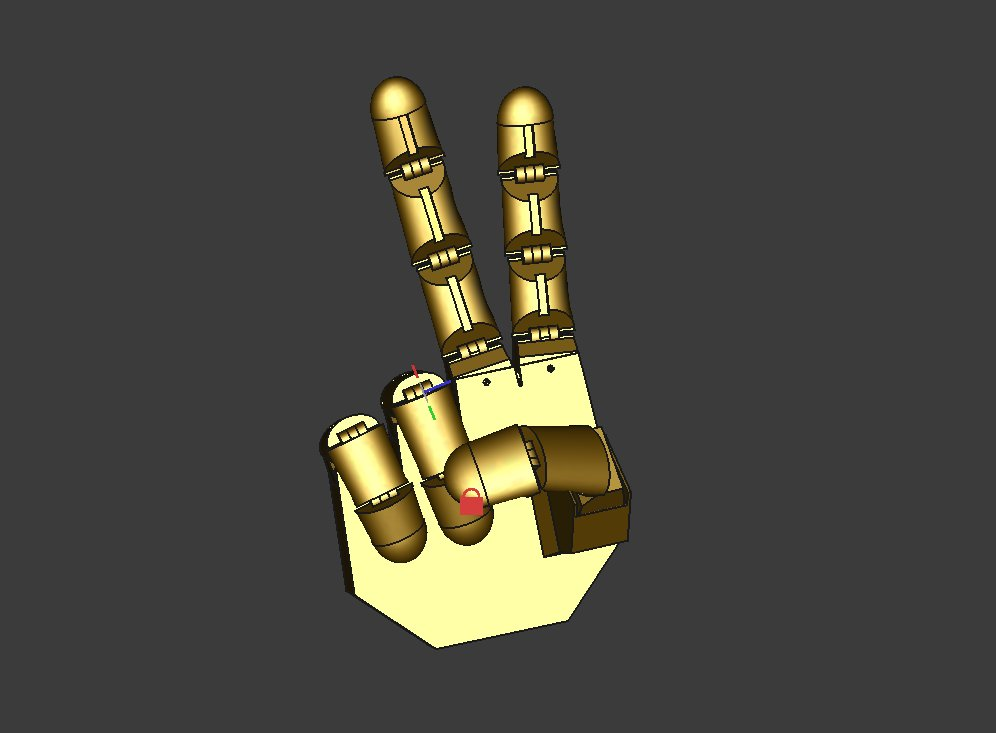

# Qrysalis.onl

ε(*´･ω･)з  
learning...

..........................

## Sep 2025

* [Introduction to Robotics](https://marsuniversity.github.io/ece387/Introduction-to-Robotics-Craig.pdf)
* [jpl nasa mechanical engineering resources](https://jpl-nasa.libguides.com/subject-guides/mechanical-engineering)
* learn basic robotics stuff like manipulator kinematics, high level control, torques,
* 3js, onshape
* cv for imitation learning

## Aug 2025

* go through fast.ai, learn pytorch
* [Deep Learning by Bishop](https://www.bishopbook.com/)
* [Transformers from scratch | peterbloem.nl](https://peterbloem.nl/blog/transformers)
* [Build a Large Language Model (From Scratch)](https://www.manning.com/books/build-a-large-language-model-from-scratch)
* [How DeepSeek Rewrote the Transformer [MLA]](https://www.youtube.com/watch?v=0VLAoVGf_74&ab_channel=WelchLabs)
* karpathy gpt2 from scratch
* simple diffusion model
* practice [deep-ml.com](https://www.deep-ml.com/problems)

## Jul 2025

* [Introduction to Robotics and Perception](https://www.roboticsbook.org/intro.html)
* skim thru [Robotics, Vision & Control](https://petercorke.com/)
* math for dl
* simple robot hand in freecad
* goal is to control the hand in sim with cv or llm
* [Math and Architectures of Deep Learning, Manning](https://www.manning.com/books/math-and-architectures-of-deep-learning)
* [Modern Robotics by Lynch and Park.](https://www.youtube.com/playlist?list=PLggLP4f-rq02vX0OQQ5vrCxbJrzamYDfx)
* [Tesla Full Self Driving explained by Andrej Karpathy](https://www.youtube.com/watch?v=3SypMvnQT_s&ab_channel=TeslaOwnersOnline)
* [I Built a Robot Dog Using... Rope?](https://www.youtube.com/watch?v=8s9TjRz01fo&t=1119s&ab_channel=AaedMusa)
* [The Physical Turing Test: Jim Fan on Nvidia's Roadmap for Embodied AI](https://www.youtube.com/watch?v=_2NijXqBESI&t=33s&ab_channel=SequoiaCapital)
* [马鹿Blyat](https://www.youtube.com/@blyat1350)

## Jun 2025

* reviewed trigonometry bc me dumb :0
* stewarts calculus
* [Interactive Linear Algebra](https://textbooks.math.gatech.edu/ila/)
* [Essence of linear algebra, 3Blue1Brown](https://www.youtube.com/playlist?list=PLZHQObOWTQDPD3MizzM2xVFitgF8hE_ab)
* [SVD Visualized, Singular Value Decomposition explained](https://www.youtube.com/watch?v=vSczTbgc8Rc&ab_channel=VisualKernel)
* [Spinning donut math](https://www.a1k0n.net/2011/07/20/donut-math.html)
* vibecoded a [spinning butterfly curve version](ass/spinningbf.mp4)
* [Mathematics for 3D Game Programming and Computer Graphics](https://mathfor3dgameprogramming.com/)
* A Mathematical Introduction to Robotic Manipulation
